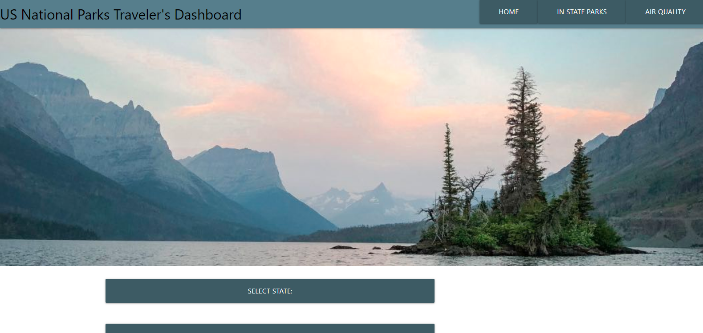

# Natioanal Parks API Group Collab

## Table of Contents
* [Description](#description)
*[User Story](#user-story)
* [Install](#install)
* [Contribution](#contribution)
* [Usage](#usage)
* [Testing](#testing)
* [Questions](#questions)
* [Visuals](#visuals)
* [License](#license)
* [Deployed](#deployed)
*[Acceptance Criteria](acceptance-criteria)

## Description
A simple App that uses server side API mainly from the National Parks Service to display Data relevent to a specific park within a State and some of its current details

## User Story 
AS A TRAVELER who wants to use their annual national parks pass…
I WANT to know what parks I can visit in this state and if the air quality is safe for me to visit …
SO THAT I can quickly narrow down which park I want to safely visit

## Install
Nothing needed to install. You hust need a Web Broweser and an Internet connection

## Contribution
Marta Wambaugh, Hoon Kim, Anton Krasnikov, Ravindra Nagi, NPS API, OMDB API, OpenWeatherMap API

## Usage
Public

## Testing
NaN

## Questions
Please reach out to me though my GitHub or via E-mail with any questions or concerns you may have  
rasvindra@hotmail.com  
https://github.com/rasvindra  

eloael@outlook.com  
https://github.com/hkim84  

marwambaugh@gmail.com  
https://github.com/mwambaugh/collaborativeAPIstudy  

krasnikovanton84@gmail.com 
github.com/kas500  

# Visuals
[Description] (url)
[Description] (url)
[Description] (url)
[Description] (url)

## License
MIT

## Deployed

## Accpetance Criteria  
Use a CSS framework other than Bootstrap.

Be deployed to GitHub Pages.

Be interactive (i.e: accept and respond to user input).

Use at least two server-side APIs.

Does not use alerts, confirms, or prompts (use modals).

Use client-side storage to store persistent data.

Be responsive.

Have a polished UI.

Have a clean repository that meets quality coding standards (file structure, naming conventions, follows best practices for class/id-naming conventions, indentation, quality comments, etc.).

Have a quality README (with unique name, description, technologies used, screenshot, and link to deployed application).