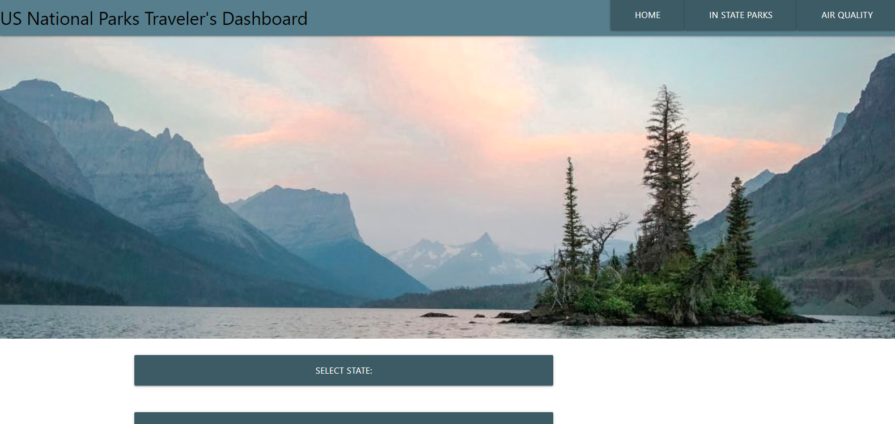

# Natioanal Parks API Group Collab

## Table of Contents
* [Description](#description)
* [Install](#install)
* [Contribution](#contribution)
* [Usage](#usage)
* [Testing](#testing)
* [Questions](#questions)
* [License](#license)
* [Deployed](#deployed)

## Description
A simple App that uses server side API mainly from the National Parks Service to display Data relevent to a specific park within a State and some of its current details

## Install
Nothing needed to install. You hust need a Web Broweser and an Internet connection

## Contribution
Marta Wambaugh, Hoon Kim, Anton Krasnikov, Ravindra Nagi, NPS API, OMDB API, OpenWeatherMap API

## Usage
Public

## Testing
NaN

## Questions
Please reach out to me though my GitHub or via E-mail with any questions or concerns you may have  
rasvindra@hotmail.com  
[github.com/rasvindra, mwambaugh, kas500, hkim84](https://github.com/rasvindra, mwambaugh, kas500, hkim84)

## License
MIT

## Deployed

